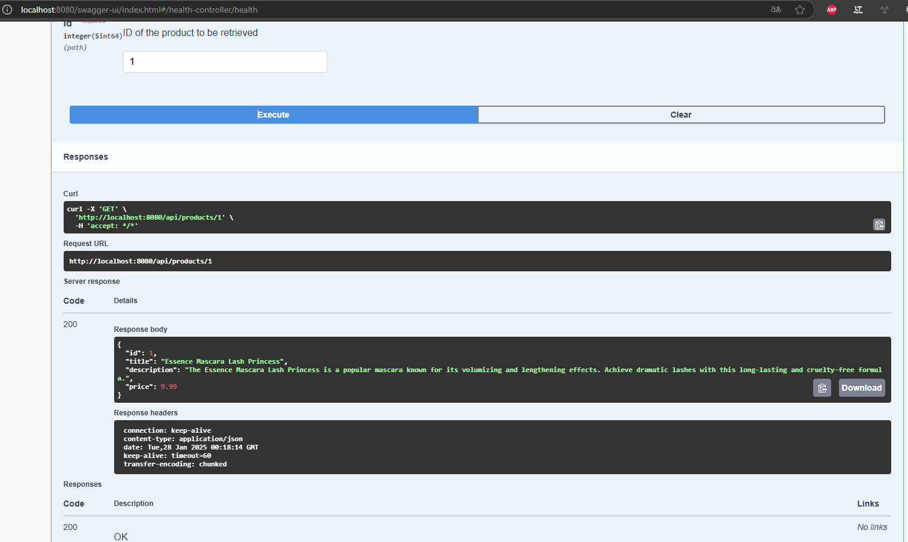

# log do Challenge
# DummyJSON Client - Java 17 e Spring Boot 3.2.5.

## Descrição do Projeto

Este projeto é um microsserviço Java que interage com a API pública [DummyJSON](https://dummyjson.com/docs/products) para realizar operações de busca de produtos. O projeto foi desenvolvido usando Java 17 e Spring Boot 3.2.5.

## Funcionalidades

- **Consulta de Produtos**: Realiza chamadas para a API do DummyJSON para buscar informações sobre produtos.
- **Integração com `WebClient`**: Utiliza `WebClient` para realizar chamadas HTTP.
- **Validação de Dados**: Validação de dados de entrada usando (`jakarta.validation`).
- **Gestão de Dependências**: Configurado para utilizar @Autowired.
- **Testes Unitários**: Inclui testes unitários desenvolvidos com SpringBootTest e JUnit 5.

## Estrutura do Projeto

```bash
dummyjson-client
├── src
│   ├── main
│   │   ├── java
│   │   │   └── com.example.dummyjsonclient
│   │   │       ├── DummyJsonClientApplication.java
│   │   │       ├── config
│   │   │       │   └── WebClientConfig.java
│   │   │       ├── controller          
│   │   │       │   └── HealthController.java 
│   │   │       │   └── ProductController.java
│   │   │       ├── dto
│   │   │       │   └── Product.java
│   │   │       ├── service
│   │   │       │   └── ProductService.java
│   │   └── resources
│   │       └── application-dev.yaml
│   │       └── application-homol.yaml
│   │       └── application-prod.yaml
│   │       └── application.yaml
│   └── test
│       ├── java
│       │   └── com.example.dummyjsonclient
│       │       ├── config
│       │       │   └── RestTemplateConfigTest.java
│       │       └── controller
│       │       │   └── HealthController.java 
│       │       │   └── ProductControllerTest.java
│       │       ├── dto
│       │       │   └── ProductTest.java
│       │       └── service
│       │           └── ProductServiceTest.java
│       └── resources
├── Dockerfile
└── pom.xml
```

## Passos para Executar o Projeto

### Pré-requisitos

- **Java 17**
- **Maven 3.8.x**

### Executar a Aplicação

1. Clone o repositório:

    ```bash
    cd dummyjson-client
    ```

2. Compile e execute o projeto:

    ```bash
    mvn clean install
    mvn spring-boot:run
    ```

3. Acesse o serviço:

    O serviço estará disponível em `http://localhost:8080/api/products/1`.

    Verifique a disponibilidade do microsserviço:

    A saúde do microsserviço pode ser verificada no endpoint `http://localhost:8080/actuator/health`.

4. Acesse o Swagger UI:
Após iniciar a aplicação, acesse a URL: `http://localhost:8080/swagger-ui.html`

Teste o endpoint no Swagger UI:

No Swagger UI, encontre o endpoint /api/products/{id} e clique nele. Você deve ver um campo para inserir o valor do parâmetro id. Insira o id desejado do produto, como o valor do parâmetro id e clique em "Execute". Você deve ver a resposta com os detalhes do produto com ID 1.



### Executar Testes

Para executar os testes unitários:

```bash
mvn clean test
```

### Executar a Aplicação com Docker

1. **Construa a imagem Docker:** Certifique-se de ter o Docker instalado e execute o seguinte comando na raiz do projeto:

    ```bash
    mvn clean package
    docker build -t dummyjsonclientjava17 .
    ```

2. **Execute o contêiner:** Para rodar a aplicação com Docker, você pode passar a variável de ambiente SPRING_PROFILE para definir o perfil ativo (por exemplo test, dev, prod):

    ```bash
    docker run -p 8080:8080 dummyjsonclientjava17
    ```

3. Acesse a aplicação no navegador ou cliente HTTP: 
O serviço estará disponível em `http://localhost:8080/api/products/1`. e também no swagger `http://localhost:8080/swagger-ui.html`


## Requisitos de Entrega atendidos

1. Atualizar o `pom.xml` para usar Java 17+ e Spring Boot 3.2.5.
2. Substituir `RestTemplate` por `WebClient` ou `Openfeign`.
3. Substituir os testes unitários feitos com `JUnit 4` e `Mockito` por testes de integração utilizando `@SpringBootTest`.
4. Refatorar qualquer código depreciado ou incompatível.
5. Garantir que todos os testes ainda passam após a migração.
6. Deixar a URL da API dummyjson parametrizada por ambiente no projeto.
7. Adicionar no projeto um novo path `/health` que retorna a saude do microsserviço.
8. Entregar o projeto em container